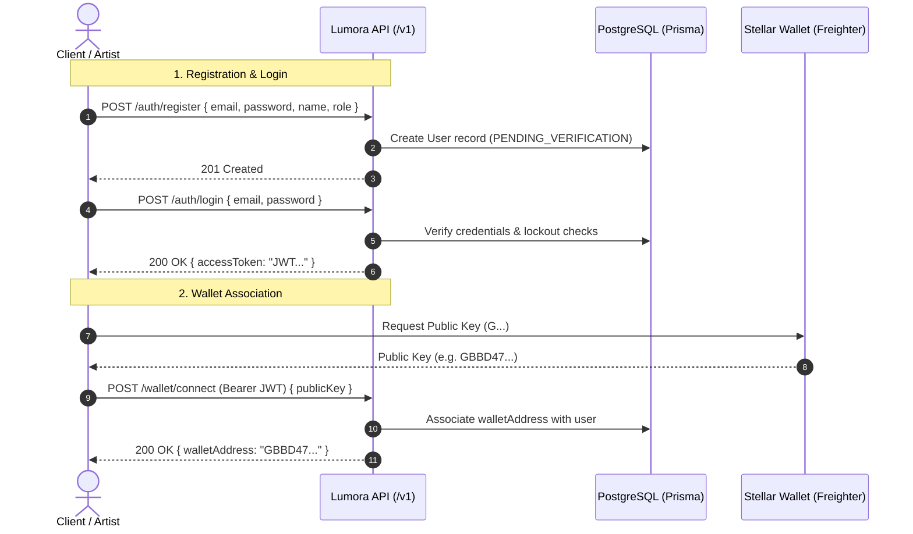
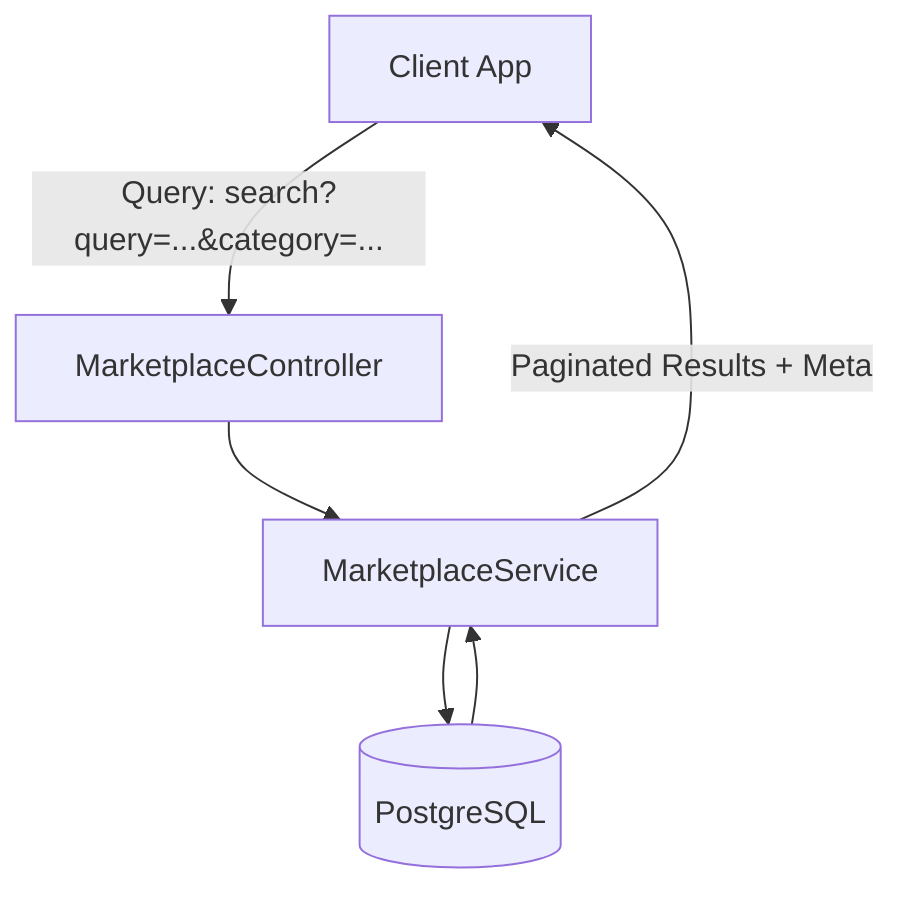
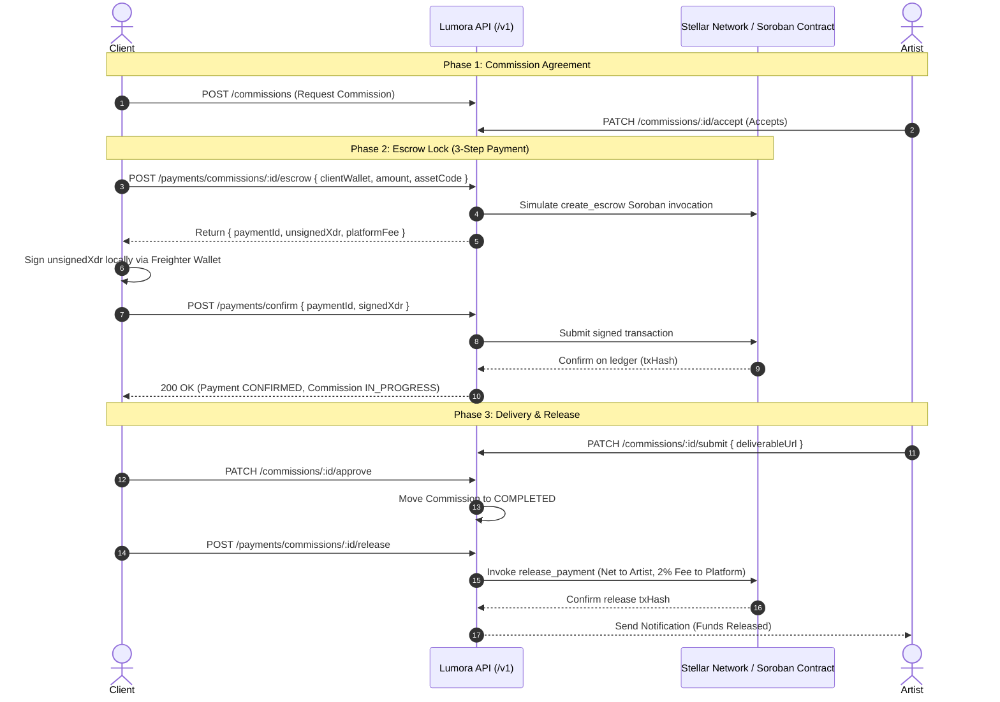

# 📚 API Usage Examples & Guide

This document provides runnable code examples and usage patterns for common operations in the **Lumora / StellarAid API**. It covers the complete user lifecycle from authentication and wallet connection to marketplace search, commission tracking, and Stellar on-chain escrow payments.

---

## 📑 Table of Contents

1. [Quick Start & Configuration](#quick-start--configuration)
2. [Postman Collection Setup](#postman-collection-setup)
3. [Authentication & Security Flow](#authentication--security-flow)
   - [User Registration](#1-user-registration)
   - [User Login & Token Storage](#2-user-login--token-storage)
   - [Stellar Wallet Connection](#3-stellar-wallet-connection)
   - [Cryptographic Wallet Signature Challenge](#4-cryptographic-wallet-signature-challenge)
4. [Marketplace Search & Discovery](#marketplace-search--discovery)
   - [Search with Filters, Sorting & Pagination](#1-search-with-filters-sorting--pagination)
   - [Global Search Across Multiple Entities](#2-global-search-across-multiple-entities)
   - [Category Browsing](#3-category-browsing)
   - [Creating a Service (Artist Only)](#4-creating-a-service-artist-only)
5. [End-to-End Payment & Escrow Workflow](#end-to-end-payment--escrow-workflow)
   - [Workflow Overview & Architecture](#1-workflow-overview--architecture)
   - [Step 1: Commission Creation & Acceptance](#step-1-commission-creation--acceptance)
   - [Step 2: Initiate Escrow (Build Unsigned XDR)](#step-2-initiate-escrow-build-unsigned-xdr)
   - [Step 3: Client Signs XDR via Freighter / Stellar SDK](#step-3-client-signs-xdr-via-freighter--stellar-sdk)
   - [Step 4: Confirm Payment on Stellar Network](#step-4-confirm-payment-on-stellar-network)
   - [Step 5: Deliverable Submission & Approval](#step-5-deliverable-submission--approval)
   - [Step 6: Release Escrow Funds to Artist](#step-6-release-escrow-funds-to-artist)
   - [Dispute Resolution (Admin Split / Refund)](#dispute-resolution-admin-split--refund)
6. [SDK Code Examples (TypeScript & Python)](#sdk-code-examples-typescript--python)

---

## 🚀 Quick Start & Configuration

All endpoints in Lumora are versioned under the `/v1/` prefix:

```bash
# Base URL for local development
http://localhost:3000/v1

# Swagger interactive documentation
http://localhost:3000/api/docs
```

### Standard Headers

| Header | Value | Description |
| :--- | :--- | :--- |
| `Content-Type` | `application/json` | Required for requests with payload |
| `Authorization` | `Bearer <JWT_TOKEN>` | Required for authenticated endpoints |

---

## 📬 Postman Collection Setup

We provide pre-built Postman collections and environments in the repository:

1. **Collection**: [`postman/stellarAid_api.postman_collection.json`](../postman/stellarAid_api.postman_collection.json)
2. **Environment**: [`postman/stellarAid_environment.postman_environment.json`](../postman/stellarAid_environment.postman_environment.json)

### Importing to Postman

1. Open Postman and click **Import** (top-left).
2. Drag and drop both JSON files from the `postman/` directory.
3. Select the **Lumora / StellarAid API - Local & Testnet** environment in the top-right environment selector.
4. Run the **Login** requests in folder `1. Authentication` — test scripts automatically populate `{{jwtToken}}`, `{{artistJwtToken}}`, and `{{clientJwtToken}}`.

---

## 🔐 Authentication & Security Flow



### 1. User Registration

Register an artist or client account.

#### cURL Request

```bash
curl -X POST http://localhost:3000/v1/auth/register \
  -H "Content-Type: application/json" \
  -d '{
    "email": "artist@lumora.io",
    "password": "SecurePassword123!",
    "name": "Elena Rostova",
    "role": "ARTIST"
  }'
```

#### JSON Response (`201 Created`)

```json
{
  "message": "Registration successful. Please verify your email to activate your account.",
  "userId": "a1b2c3d4-e5f6-7890-abcd-ef1234567890"
}
```

---

### 2. User Login & Token Storage

Authenticate using email and password to receive a JWT access token.

#### cURL Request

```bash
curl -X POST http://localhost:3000/v1/auth/login \
  -H "Content-Type: application/json" \
  -d '{
    "email": "artist@lumora.io",
    "password": "SecurePassword123!"
  }'
```

#### JSON Response (`200 OK`)

```json
{
  "accessToken": "eyJhbGciOiJIUzI1NiIsInR5cCI6IkpXVCJ9.eyJzdWIiOiJhMWIyYzNkNC1lNWY2LTc4OTAtYWJjZC1lZjEyMzQ1Njc4OTAiLCJlbWFpbCI6ImFydGlzdEBsdW1vcmEuaW8iLCJyb2xlIjoiQVJUSVNUIiwiaWF0IjoxNzA4ODAwMDAwLCJleHAiOjE3MDg4ODY0MDB9.abcdef...",
  "user": {
    "id": "a1b2c3d4-e5f6-7890-abcd-ef1234567890",
    "email": "artist@lumora.io",
    "name": "Elena Rostova",
    "role": "ARTIST",
    "walletAddress": null
  }
}
```

---

### 3. Stellar Wallet Connection

Link a Stellar ed25519 public address (starts with `G`) to the authenticated user profile.

#### cURL Request

```bash
curl -X POST http://localhost:3000/v1/wallet/connect \
  -H "Content-Type: application/json" \
  -H "Authorization: Bearer <YOUR_JWT_TOKEN>" \
  -d '{
    "publicKey": "GBBD47IF6LWK7P7MDEVSCWR7DPUWV3NY3DTQEVFL4NAT4AQH3ZLLFLA5"
  }'
```

#### JSON Response (`200 OK`)

```json
{
  "message": "Wallet connected successfully",
  "walletAddress": "GBBD47IF6LWK7P7MDEVSCWR7DPUWV3NY3DTQEVFL4NAT4AQH3ZLLFLA5"
}
```

---

### 4. Cryptographic Wallet Signature Challenge

To cryptographically verify wallet ownership without sharing private keys, the client signs a server-generated challenge string using their ed25519 keypair.

#### TypeScript Verification Example

```typescript
import { Keypair } from '@stellar/stellar-sdk';
import { generateWalletChallenge, verifyWalletSignature } from './src/common/wallet/wallet-signature.util';

// 1. Server generates single-use challenge:
const challenge = generateWalletChallenge();
// e.g. "stellar-aid-verify:6a7f8e9d0c1b2a3f..."

// 2. Client signs with Stellar Keypair (or Freighter wallet):
const clientKeypair = Keypair.fromSecret('S...');
const signatureBytes = clientKeypair.sign(Buffer.from(challenge, 'utf8'));
const signatureBase64 = signatureBytes.toString('base64');

// 3. Server verifies signature against public key:
const isValid = verifyWalletSignature(clientKeypair.publicKey(), challenge, signatureBase64);
console.log('Is signature authentic?', isValid); // true
```

---

## 🔍 Marketplace Search & Discovery

Lumora provides rich multi-parameter search, category filtering, and global entity exploration.



### 1. Search with Filters, Sorting & Pagination

Search services matching keywords, category, price range, and custom sort order.

#### Query Parameters

| Parameter | Type | Default | Description |
| :--- | :--- | :--- | :--- |
| `query` | `string` | optional | Matches against service `title` and `description` |
| `category` | `string` | optional | Matches category (e.g. `ILLUSTRATION`, `UI_UX`, `GRAPHIC_DESIGN`, `BRANDING`) |
| `minPrice` | `number` | optional | Minimum price filter in USDC / base units |
| `maxPrice` | `number` | optional | Maximum price filter in USDC / base units |
| `sortBy` | `string` | `createdAt` | Field to sort: `priceUsdc`, `createdAt`, `title` |
| `sortOrder` | `string` | `desc` | `asc` or `desc` |
| `page` | `number` | `1` | Page number |
| `limit` | `number` | `10` | Number of items per page (max: 50) |

#### cURL Request

```bash
curl -X GET "http://localhost:3000/v1/marketplace/services/search?query=stellar&category=ILLUSTRATION&minPrice=50&maxPrice=300&sortBy=priceUsdc&sortOrder=asc&page=1&limit=10" \
  -H "Accept: application/json"
```

#### JSON Response (`200 OK`)

```json
{
  "data": [
    {
      "id": "c3f81e6b-3129-4d2c-9892-0b1a8c9e54d2",
      "title": "Custom Stellar NFT & Character Illustration",
      "description": "High quality vector illustrations and generative assets optimized for Stellar Soroban dApps.",
      "category": "ILLUSTRATION",
      "priceUsdc": "120.00",
      "deliveryDays": 4,
      "revisions": 3,
      "features": [
        "Vector Source (.SVG, .AI)",
        "Commercial Usage Rights",
        "Transparent PNG exports (4K)"
      ],
      "isActive": true,
      "artist": {
        "id": "art-0987-fedc",
        "averageRating": 4.95,
        "totalReviews": 42,
        "user": {
          "name": "Elena Rostova",
          "walletAddress": "GCB2X5V76EAF4Z4ZTRKMSW3O36N5L2F4A5E4V5F5B5N5M5K5J5H5G5F5"
        }
      }
    }
  ],
  "meta": {
    "total": 1,
    "page": 1,
    "limit": 10,
    "totalPages": 1
  }
}
```

---

### 2. Global Search Across Multiple Entities

Search across artists, portfolios, and services simultaneously with `/v1/search`.

```bash
curl -X GET "http://localhost:3000/v1/search?q=web3+design&type=services&page=1&limit=5"
```

---

### 3. Category Browsing

Get all portfolio categories with active counts:

```bash
curl -X GET "http://localhost:3000/v1/discover/categories"
```

#### Response

```json
[
  { "category": "ILLUSTRATION", "count": 34 },
  { "category": "UI_UX", "count": 28 },
  { "category": "GRAPHIC_DESIGN", "count": 45 },
  { "category": "BRANDING", "count": 19 },
  { "category": "ANIMATION", "count": 12 }
]
```

---

### 4. Creating a Service (Artist Only)

Artists can publish their offerings to the marketplace.

```bash
curl -X POST http://localhost:3000/v1/marketplace/services \
  -H "Content-Type: application/json" \
  -H "Authorization: Bearer <ARTIST_JWT_TOKEN>" \
  -d '{
    "title": "Full Soroban DApp UI/UX Design System",
    "description": "Complete interactive design system in Figma with dark/light themes and smart contract component states.",
    "category": "UI_UX",
    "priceUsdc": 350,
    "deliveryDays": 7,
    "revisions": 5,
    "features": [
      "Figma Source File",
      "Interactive Prototype",
      "Tailwind-ready design tokens",
      "Mobile and Desktop responsive layouts"
    ]
  }'
```

---

## 💳 End-to-End Payment & Escrow Workflow

Lumora provides a secure, non-custodial smart escrow lifecycle powered by Stellar and Soroban.

### 1. Workflow Overview & Architecture



---

### Step 1: Commission Creation & Acceptance

1. **Client sends commission request:**

```bash
curl -X POST http://localhost:3000/v1/commissions \
  -H "Content-Type: application/json" \
  -H "Authorization: Bearer <CLIENT_JWT_TOKEN>" \
  -d '{
    "artistId": "art-0987-fedc",
    "serviceId": "c3f81e6b-3129-4d2c-9892-0b1a8c9e54d2",
    "title": "Hero Illustration for Stellar DApp",
    "description": "Isometric vector scene showing cross-border payments.",
    "budgetUsdc": 200,
    "deadline": "2026-11-15T00:00:00.000Z"
  }'
```

2. **Artist accepts the commission:**

```bash
curl -X PATCH http://localhost:3000/v1/commissions/<COMMISSION_ID>/accept \
  -H "Authorization: Bearer <ARTIST_JWT_TOKEN>"
```

---

### Step 2: Initiate Escrow (Build Unsigned XDR)

Client triggers escrow setup. The API builds the unsigned Soroban `create_escrow` transaction and returns the base64-encoded XDR.

#### cURL Request

```bash
curl -X POST http://localhost:3000/v1/payments/commissions/<COMMISSION_ID>/escrow \
  -H "Content-Type: application/json" \
  -H "Authorization: Bearer <CLIENT_JWT_TOKEN>" \
  -d '{
    "clientWallet": "GBBD47IF6LWK7P7MDEVSCWR7DPUWV3NY3DTQEVFL4NAT4AQH3ZLLFLA5",
    "amount": 200,
    "assetCode": "XLM"
  }'
```

> **For Custom Assets (e.g. USDC):** Include `"assetIssuer": "GA5ZSEJYB37JRC5AVCIA5MOP4RHTM335X2KGX3IHOJAPP5RE34K4KZVN"`.

#### JSON Response (`201 Created`)

```json
{
  "paymentId": "7e9b0123-4567-89ab-cdef-0123456789ab",
  "unsignedXdr": "AAAAAgAAAAC5kL34KjY9...",
  "amount": 200,
  "assetCode": "XLM",
  "platformFee": 4.0
}
```

---

### Step 3: Client Signs XDR via Freighter / Stellar SDK

The frontend prompts the client's wallet to sign the unsigned XDR.

#### Frontend Code (Freighter Wallet)

```javascript
import { signTransaction } from '@stellar/freighter-api';

async function signEscrowTransaction(unsignedXdr, networkPassphrase) {
  const signedXdr = await signTransaction(unsignedXdr, {
    networkPassphrase: networkPassphrase || 'Test SDF Network ; September 2015',
  });
  return signedXdr;
}
```

---

### Step 4: Confirm Payment on Stellar Network

The client submits the signed XDR to the API, which broadcasts it to the Stellar network and verifies ledger inclusion.

#### cURL Request

```bash
curl -X POST http://localhost:3000/v1/payments/confirm \
  -H "Content-Type: application/json" \
  -H "Authorization: Bearer <CLIENT_JWT_TOKEN>" \
  -d '{
    "paymentId": "7e9b0123-4567-89ab-cdef-0123456789ab",
    "signedXdr": "AAAAAgAAAAC5kL34KjY9...SIGNED_XDR..."
  }'
```

#### JSON Response (`200 OK`)

```json
{
  "paymentId": "7e9b0123-4567-89ab-cdef-0123456789ab",
  "txHash": "4a71b28c6e2646d6d45e52514101e4054a3dc43272e7d722bf1359d9544c8b0c",
  "status": "CONFIRMED"
}
```

---

### Step 5: Deliverable Submission & Approval

1. **Artist submits completed work:**

```bash
curl -X PATCH http://localhost:3000/v1/commissions/<COMMISSION_ID>/submit \
  -H "Content-Type: application/json" \
  -H "Authorization: Bearer <ARTIST_JWT_TOKEN>" \
  -d '{
    "deliverableUrl": "https://storage.lumora.io/deliverables/final_hero.zip",
    "notes": "Includes SVG vector master and light/dark variations."
  }'
```

2. **Client approves deliverable:**

```bash
curl -X PATCH http://localhost:3000/v1/commissions/<COMMISSION_ID>/approve \
  -H "Authorization: Bearer <CLIENT_JWT_TOKEN>"
```

---

### Step 6: Release Escrow Funds to Artist

Once approved, the client or system triggers escrow release. The platform signs the on-chain release transaction, sending the net funds (e.g. 196 XLM) to the artist and platform fee (e.g. 4 XLM) to the platform treasury.

#### cURL Request

```bash
curl -X POST http://localhost:3000/v1/payments/commissions/<COMMISSION_ID>/release \
  -H "Authorization: Bearer <CLIENT_JWT_TOKEN>"
```

#### JSON Response (`200 OK`)

```json
{
  "paymentId": "7e9b0123-4567-89ab-cdef-0123456789ab",
  "txHash": "89b524cae42095f9c9b4e7235a92a5b1f0923e59b794f386d8a7c2937e0c451d",
  "status": "RELEASED",
  "netAmount": 196.0,
  "assetCode": "XLM"
}
```

---

### Dispute Resolution (Admin Split / Refund)

If a commission is marked `DISPUTED`, an administrator can resolve it with one of three strategies:

1. `REFUND`: 100% of funds returned to client wallet on-chain.
2. `RELEASE`: 100% of net funds released to artist wallet on-chain.
3. `PARTIAL`: Split funds based on basis points (`artistShareBps`: `5000` = 50%).

#### Partial Split cURL Request (Admin Only)

```bash
curl -X POST http://localhost:3000/v1/admin/commissions/<COMMISSION_ID>/resolve-dispute \
  -H "Content-Type: application/json" \
  -H "Authorization: Bearer <ADMIN_JWT_TOKEN>" \
  -d '{
    "resolution": "PARTIAL",
    "artistShareBps": 7000,
    "notes": "70% work completed per intermediate draft review."
  }'
```

---

## 💻 SDK Code Examples (TypeScript & Python)

### Complete TypeScript Client Workflow

```typescript
import axios from 'axios';
import { signTransaction } from '@stellar/freighter-api';

const API_BASE = 'http://localhost:3000/v1';

async function runClientFlow() {
  // 1. Log in as client
  const loginRes = await axios.post(`${API_BASE}/auth/login`, {
    email: 'client@lumora.io',
    password: 'SecureClient123!',
  });
  const token = loginRes.data.accessToken;
  const headers = { Authorization: `Bearer ${token}` };

  // 2. Connect client Stellar wallet
  const clientPublicKey = 'GBBD47IF6LWK7P7MDEVSCWR7DPUWV3NY3DTQEVFL4NAT4AQH3ZLLFLA5';
  await axios.post(`${API_BASE}/wallet/connect`, { publicKey: clientPublicKey }, { headers });

  // 3. Search for available illustration services
  const searchRes = await axios.get(`${API_BASE}/marketplace/services/search`, {
    params: { category: 'ILLUSTRATION', maxPrice: 300 },
  });
  const selectedService = searchRes.data.data[0];
  console.log(`Found service: ${selectedService.title} ($${selectedService.priceUsdc})`);

  // 4. Create commission request
  const commissionRes = await axios.post(
    `${API_BASE}/commissions`,
    {
      artistId: selectedService.artist.id,
      serviceId: selectedService.id,
      title: 'DApp Banner Design',
      description: 'Vector banner for Stellar project launch',
      budgetUsdc: Number(selectedService.priceUsdc),
      deadline: new Date(Date.now() + 7 * 86400000).toISOString(),
    },
    { headers },
  );
  const commissionId = commissionRes.data.id;

  // 5. Initiate Escrow Payment
  const escrowRes = await axios.post(
    `${API_BASE}/payments/commissions/${commissionId}/escrow`,
    {
      clientWallet: clientPublicKey,
      amount: Number(selectedService.priceUsdc),
      assetCode: 'XLM',
    },
    { headers },
  );

  const { paymentId, unsignedXdr } = escrowRes.data;

  // 6. Sign XDR using Freighter
  const signedXdr = await signTransaction(unsignedXdr, {
    networkPassphrase: 'Test SDF Network ; September 2015',
  });

  // 7. Confirm Payment on API & Stellar Network
  const confirmRes = await axios.post(
    `${API_BASE}/payments/confirm`,
    { paymentId, signedXdr },
    { headers },
  );
  console.log(`Payment confirmed on-chain! TxHash: ${confirmRes.data.txHash}`);
}
```

### Complete Python Client Workflow

```python
import requests

API_BASE = "http://localhost:3000/v1"

# 1. Login
session = requests.Session()
login_res = session.post(f"{API_BASE}/auth/login", json={
    "email": "client@lumora.io",
    "password": "SecureClient123!"
})
token = login_res.json()["accessToken"]
session.headers.update({"Authorization": f"Bearer {token}"})

# 2. Search Marketplace Services
search_res = session.get(f"{API_BASE}/marketplace/services/search", params={
    "query": "stellar",
    "category": "ILLUSTRATION",
    "minPrice": 10,
    "maxPrice": 500,
    "sortBy": "priceUsdc",
    "sortOrder": "asc"
})
services = search_res.json()["data"]
print(f"Found {len(services)} services matching criteria.")

# 3. View Service Details
if services:
    service_id = services[0]["id"]
    detail_res = session.get(f"{API_BASE}/marketplace/services/{service_id}")
    print("Service Detail:", detail_res.json()["title"])
```
