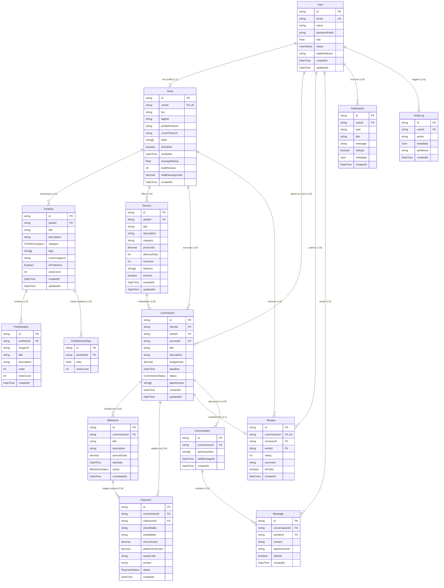
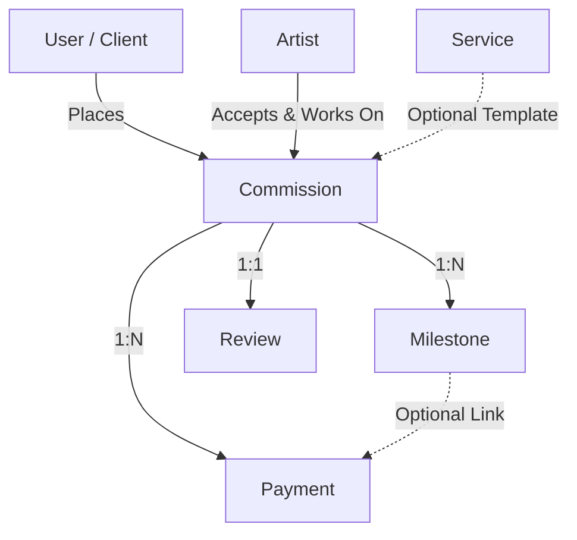
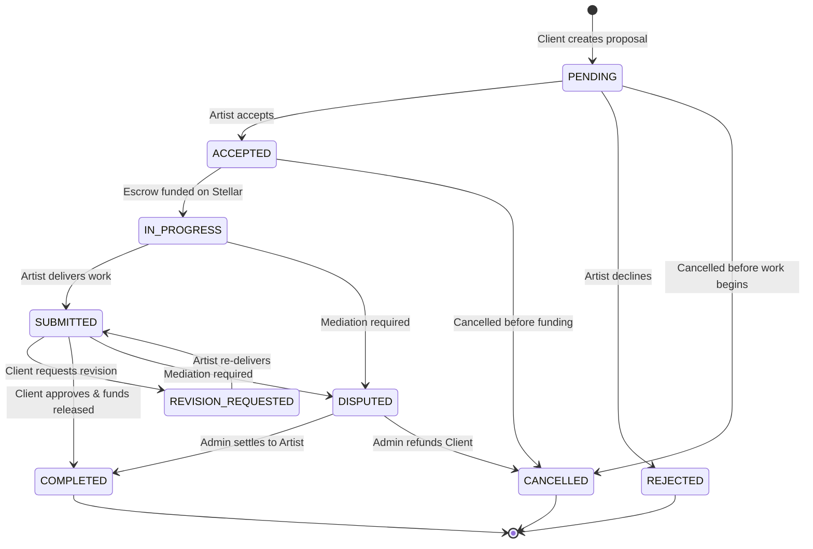
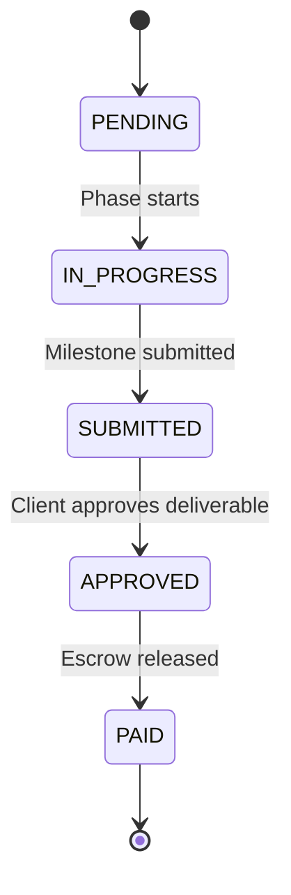
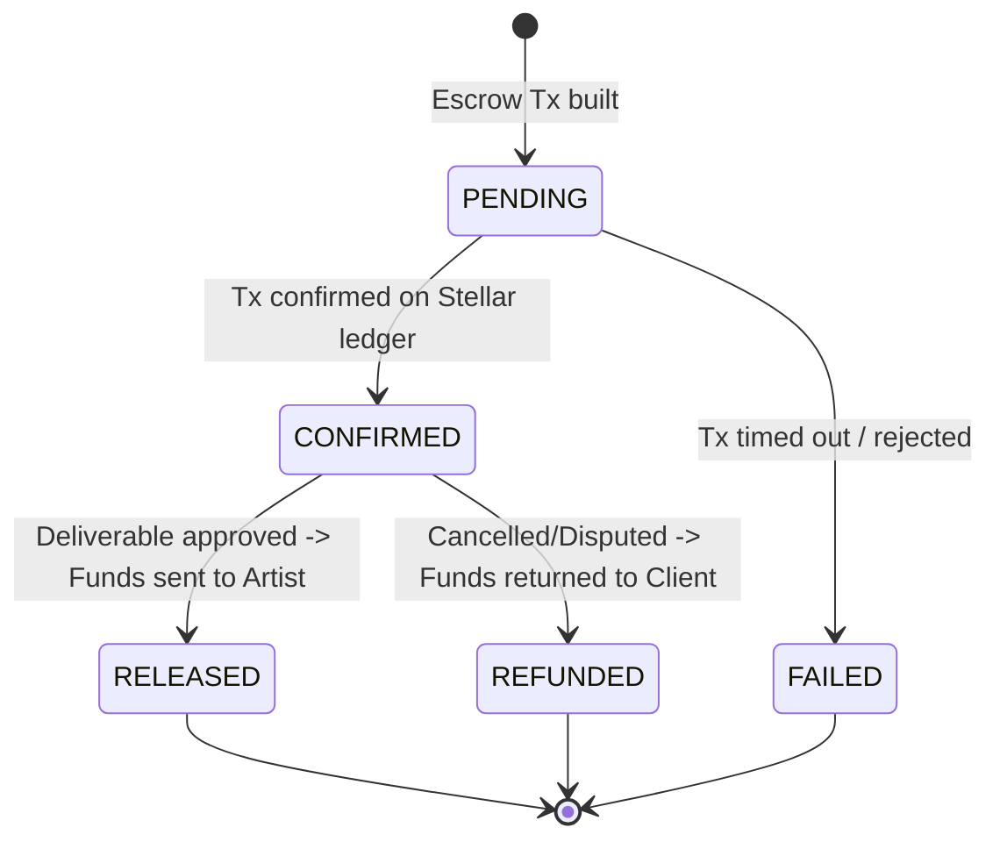
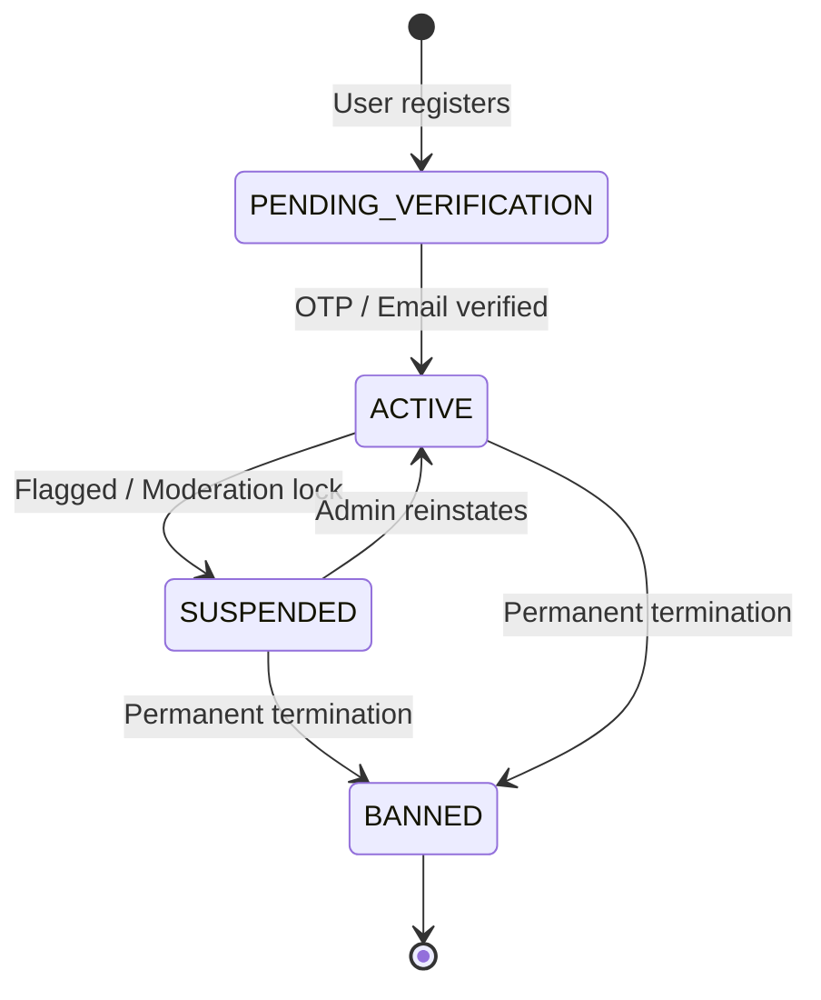

# Database Schema Documentation

This document provides a comprehensive technical overview of the PostgreSQL database schema for **Lumora API** (stellarAid-api), managed via **Prisma ORM**. It details each entity model, entity-relationship diagrams (ERDs), foreign key constraints, field validation rules, and lifecycle state machines.

---

## Table of Contents

1. [Architectural Overview](#1-architectural-overview)
2. [Entity Relationship Diagrams (ERD)](#2-entity-relationship-diagrams-erd)
   - [Complete System ERD](#complete-system-erd)
   - [Core Subsystem Diagrams](#core-subsystem-diagrams)
3. [Model Catalog & Data Dictionaries](#3-model-catalog--data-dictionaries)
   - [User & Identity](#user)
   - [Artist Profile](#artist)
   - [Portfolio & PortfolioItem](#portfolio--portfolioitem)
   - [PortfolioViewDay (Analytics)](#portfolioviewday)
   - [Service (Marketplace)](#service)
   - [Commission (Contracts)](#commission)
   - [Milestone](#milestone)
   - [Payment (Stellar Escrow)](#payment)
   - [Review & Reputation](#review)
   - [Conversation & Message (Chat)](#conversation--message)
   - [Notification & AuditLog](#notification--auditlog)
4. [Foreign Key Relationships & Cascades](#4-foreign-key-relationships--cascades)
5. [Data Validation Rules & Integrity Constraints](#5-data-validation-rules--integrity-constraints)
   - [Database-Level Constraints](#database-level-constraints)
   - [Financial Precision & Decimal Rules](#financial-precision--decimal-rules)
   - [Application-Level Validation (DTOs)](#application-level-validation-dtos)
6. [State Machines & Enum Lifecycles](#6-state-machines--enum-lifecycles)
   - [Commission Lifecycle](#commission-lifecycle)
   - [Milestone Lifecycle](#milestone-lifecycle)
   - [Payment / Escrow Lifecycle](#payment--escrow-lifecycle)
   - [User Account Status](#user-account-status)
7. [Indexing & Query Optimization](#7-indexing--query-optimization)

---

## 1. Architectural Overview

- **Database Engine:** PostgreSQL 15+
- **ORM / Migration Tool:** Prisma ORM (`@prisma/client` & `prisma-cli`)
- **Primary Keys:** UUID v4 across all relational tables (`@default(uuid())`)
- **Temporal Tracking:** Automatic timestamp tracking (`createdAt @default(now())`, `updatedAt @updatedAt`)
- **Decimal Precision:** Financial amounts stored as PostgreSQL `DECIMAL` / `NUMERIC` types to avoid binary floating-point rounding errors.

---

## 2. Entity Relationship Diagrams (ERD)

### Complete System ERD

The diagram below illustrates all 14 models and their relational cardinality across the system:



---

### Core Subsystem Diagrams

#### 1. Identity & Artist Profile Subsystem
```mermaid
graph TD
    U[User] -->|1:1 (Optional)| A[Artist]
    U -->|1:N| AL[AuditLog]
    U -->|1:N| N[Notification]
```

#### 2. Marketplace & Portfolios Subsystem
```mermaid
graph TD
    A[Artist] -->|1:N| P[Portfolio]
    A -->|1:N| S[Service]
    P -->|1:N (Cascade Delete)| PI[PortfolioItem]
    P -->|1:N (Cascade Delete)| PVD[PortfolioViewDay]
```

#### 3. Commission & Escrow Payment Subsystem


---

## 3. Model Catalog & Data Dictionaries

### `User`
The primary authentication and identity model representing all actors in the platform.

| Field | Type | Attributes | Nullable | Description |
| :--- | :--- | :--- | :--- | :--- |
| `id` | `String` | `@id @default(uuid())` | No | Unique User ID (UUID v4) |
| `email` | `String` | `@unique` | No | User email address (case-insensitive in business logic) |
| `name` | `String` | | No | Full display name |
| `passwordHash` | `String` | | No | Salted bcrypt hash of user password |
| `role` | `Role` | `@default(ARTIST)` | No | User authorization role (`ARTIST`, `CLIENT`, `BUSINESS`, `ADMIN`) |
| `status` | `UserStatus` | `@default(PENDING_VERIFICATION)` | No | Account status (`PENDING_VERIFICATION`, `ACTIVE`, `SUSPENDED`, `BANNED`) |
| `walletAddress` | `String` | | Yes | Stellar Public Key (`G...` ed25519 56-char address) |
| `createdAt` | `DateTime` | `@default(now())` | No | Timestamp of account registration |
| `updatedAt` | `DateTime` | `@updatedAt` | No | Timestamp of last user record update |

---

### `Artist`
Extension profile attached to a `User` when role is `ARTIST`. Houses creative credentials, rating aggregations, and lifetime USDC earnings.

| Field | Type | Attributes | Nullable | Description |
| :--- | :--- | :--- | :--- | :--- |
| `id` | `String` | `@id @default(uuid())` | No | Unique Artist Profile ID |
| `userId` | `String` | `@unique` | No | Foreign key linking to `User.id` |
| `bio` | `String` | | Yes | Extended biography / artist statement |
| `tagline` | `String` | | Yes | Brief headline displayed on artist cards |
| `profilePhotoUrl` | `String` | | Yes | Avatar image URL |
| `coverPhotoUrl` | `String` | | Yes | Profile banner image URL |
| `skills` | `String[]` | | No | Array of skill tags (e.g. `["Illustration", "Blender", "UI"]`) |
| `isVerified` | `Boolean` | `@default(false)` | No | Platform verification badge status |
| `verifiedAt` | `DateTime` | | Yes | Timestamp of admin verification |
| `averageRating` | `Float` | `@default(0)` | No | Aggregated star rating (0.00 to 5.00) |
| `totalReviews` | `Int` | `@default(0)` | No | Total count of completed reviews received |
| `totalEarningsUsdc` | `Decimal` | `@default(0)` | No | Cumulative USDC revenue earned |
| `createdAt` | `DateTime` | `@default(now())` | No | Timestamp when profile was initialized |

---

### `Portfolio` & `PortfolioItem`
Represents public or draft creative projects and individual media items.

#### `Portfolio`
| Field | Type | Attributes | Nullable | Description |
| :--- | :--- | :--- | :--- | :--- |
| `id` | `String` | `@id @default(uuid())` | No | Unique Portfolio ID |
| `artistId` | `String` | | No | Foreign key linking to `Artist.id` |
| `title` | `String` | | No | Title of the portfolio entry |
| `description` | `String` | | No | Extended project overview |
| `category` | `PortfolioCategory`| | No | Category enum (`ILLUSTRATION`, `UI_UX`, etc.) |
| `tags` | `String[]` | | No | Array of searchable keywords |
| `coverImageUrl` | `String` | | No | Primary hero/thumbnail image URL |
| `isPublished` | `Boolean` | `@default(false)` | No | Publication status flag |
| `viewCount` | `Int` | `@default(0)` | No | Lifetime view counter |
| `createdAt` | `DateTime` | `@default(now())` | No | Creation timestamp |
| `updatedAt` | `DateTime` | `@updatedAt` | No | Last modification timestamp |

#### `PortfolioItem`
| Field | Type | Attributes | Nullable | Description |
| :--- | :--- | :--- | :--- | :--- |
| `id` | `String` | `@id @default(uuid())` | No | Unique item ID |
| `portfolioId` | `String` | | No | Foreign key linking to parent `Portfolio.id` |
| `imageUrl` | `String` | | No | Hosted asset URL |
| `title` | `String` | | No | Asset title / caption |
| `description` | `String` | | No | Asset description / notes |
| `order` | `Int` | | No | Sequence index in gallery |
| `viewCount` | `Int` | `@default(0)` | No | Asset view impressions |
| `createdAt` | `DateTime` | `@default(now())` | No | Upload timestamp |

---

### `PortfolioViewDay`
Aggregated daily view metrics for portfolio analytics, supporting chart rendering and performance reporting.

| Field | Type | Attributes | Nullable | Description |
| :--- | :--- | :--- | :--- | :--- |
| `id` | `String` | `@id @default(uuid())` | No | Unique analytics entry ID |
| `portfolioId` | `String` | | No | Foreign key referencing `Portfolio.id` |
| `date` | `DateTime` | `@db.Date` | No | UTC calendar date (YYYY-MM-DD) |
| `viewCount` | `Int` | `@default(0)` | No | View count accumulated on this day |

**Indices & Constraints:**
- `@@unique([portfolioId, date])` — Guarantees exactly one record per portfolio per day.
- `@@index([portfolioId, date])` — Optimized for date range queries (e.g. past 7, 30, or 90 days).
- On delete behavior: `Cascade` (deleting portfolio deletes its daily view history).

---

### `Service`
Predefined fixed-scope service packages offered by artists in the marketplace.

| Field | Type | Attributes | Nullable | Description |
| :--- | :--- | :--- | :--- | :--- |
| `id` | `String` | `@id @default(uuid())` | No | Unique Service ID |
| `artistId` | `String` | | No | Foreign key linking to `Artist.id` |
| `title` | `String` | | No | Service package headline |
| `description` | `String` | | No | Detailed scope of work |
| `category` | `String` | | No | Service category |
| `priceUsdc` | `Decimal` | | No | Fixed package price in USDC |
| `deliveryDays` | `Int` | | No | Expected delivery turnaround in days |
| `revisions` | `Int` | | No | Number of included revision rounds |
| `features` | `String[]` | | No | Array of included deliverables |
| `isActive` | `Boolean` | `@default(true)` | No | Availability toggle for ordering |
| `createdAt` | `DateTime` | `@default(now())` | No | Creation timestamp |
| `updatedAt` | `DateTime` | `@updatedAt` | No | Last update timestamp |

---

### `Commission`
Bespoke agreements or marketplace orders between a client and an artist.

| Field | Type | Attributes | Nullable | Description |
| :--- | :--- | :--- | :--- | :--- |
| `id` | `String` | `@id @default(uuid())` | No | Unique Commission ID |
| `clientId` | `String` | | No | Foreign key referencing Client `User.id` |
| `artistId` | `String` | | No | Foreign key referencing `Artist.id` |
| `serviceId` | `String` | | Yes | Optional foreign key referencing `Service.id` |
| `title` | `String` | | No | Project title / brief |
| `description` | `String` | | No | Project specifications & requirements |
| `budgetUsdc` | `Decimal` | | No | Total agreed price in USDC |
| `deadline` | `DateTime` | | No | Final milestone completion deadline |
| `status` | `CommissionStatus` | `@default(PENDING)` | No | Current lifecycle status |
| `attachments` | `String[]` | | No | Array of reference or final deliverable file URLs |
| `createdAt` | `DateTime` | `@default(now())` | No | Order creation timestamp |
| `updatedAt` | `DateTime` | `@updatedAt` | No | Last status or brief update timestamp |

---

### `Milestone`
Phased deliverable chunks within a Commission contract.

| Field | Type | Attributes | Nullable | Description |
| :--- | :--- | :--- | :--- | :--- |
| `id` | `String` | `@id @default(uuid())` | No | Unique Milestone ID |
| `commissionId` | `String` | | No | Foreign key referencing parent `Commission.id` |
| `title` | `String` | | No | Deliverable milestone title |
| `description` | `String` | | No | Milestone requirements and deliverables |
| `amountUsdc` | `Decimal` | | No | Allocated budget payout for this milestone |
| `dueDate` | `DateTime` | | No | Target delivery date |
| `status` | `MilestoneStatus` | `@default(PENDING)` | No | Phase state (`PENDING`, `IN_PROGRESS`, etc.) |
| `completedAt` | `DateTime` | | Yes | Timestamp of client sign-off |

---

### `Payment`
On-chain Stellar/Soroban escrow and disbursement ledger entry.

| Field | Type | Attributes | Nullable | Description |
| :--- | :--- | :--- | :--- | :--- |
| `id` | `String` | `@id @default(uuid())` | No | Unique Payment ID |
| `commissionId` | `String` | | No | Foreign key referencing parent `Commission.id` |
| `milestoneId` | `String` | | Yes | Optional foreign key referencing `Milestone.id` |
| `clientWallet` | `String` | | No | Stellar G-address of payer |
| `artistWallet` | `String` | | No | Stellar G-address of payee |
| `amountUsdc` | `Decimal` | | No | Principal payment sum in USDC |
| `platformFeeUsdc` | `Decimal` | | No | Platform fee collected in USDC (default 2%) |
| `assetCode` | `String` | | No | Token asset code (`USDC`, `XLM`, etc.) |
| `txHash` | `String` | | Yes | On-chain Stellar transaction hash |
| `status` | `PaymentStatus` | `@default(PENDING)` | No | Payment state (`PENDING`, `CONFIRMED`, `RELEASED`, etc.) |
| `createdAt` | `DateTime` | `@default(now())` | No | Transaction creation timestamp |

---

### `Review`
Client feedback and rating submitted upon commission completion.

| Field | Type | Attributes | Nullable | Description |
| :--- | :--- | :--- | :--- | :--- |
| `id` | `String` | `@id @default(uuid())` | No | Unique Review ID |
| `commissionId` | `String` | `@unique` | No | Foreign key referencing `Commission.id` (1:1 constraint) |
| `reviewerId` | `String` | | No | Foreign key referencing Client `User.id` |
| `artistId` | `String` | | No | Foreign key referencing `Artist.id` |
| `rating` | `Int` | | No | Star rating integer (1 to 5) |
| `comment` | `String` | | Yes | Written review comment |
| `isPublic` | `Boolean` | `@default(true)` | No | Public visibility flag |
| `createdAt` | `DateTime` | `@default(now())` | No | Submission timestamp |

---

### `Conversation` & `Message`
Real-time in-app communication between clients and artists.

#### `Conversation`
| Field | Type | Attributes | Nullable | Description |
| :--- | :--- | :--- | :--- | :--- |
| `id` | `String` | `@id @default(uuid())` | No | Unique Conversation ID |
| `commissionId` | `String` | | Yes | Optional foreign key linking to a `Commission.id` |
| `participantIds` | `String[]` | | No | Array of User IDs participating in the conversation |
| `lastMessageAt` | `DateTime` | `@default(now())` | No | Timestamp of latest message (used for inbox sorting) |
| `createdAt` | `DateTime` | `@default(now())` | No | Initiation timestamp |

#### `Message`
| Field | Type | Attributes | Nullable | Description |
| :--- | :--- | :--- | :--- | :--- |
| `id` | `String` | `@id @default(uuid())` | No | Unique Message ID |
| `conversationId` | `String` | | No | Foreign key referencing parent `Conversation.id` |
| `senderId` | `String` | | No | Foreign key referencing author `User.id` |
| `content` | `String` | | No | Text content of the message |
| `attachmentUrl` | `String` | | Yes | Optional file or image attachment URL |
| `isRead` | `Boolean` | `@default(false)` | No | Read status flag |
| `createdAt` | `DateTime` | `@default(now())` | No | Timestamp dispatched |

---

### `Notification` & `AuditLog`

#### `Notification`
| Field | Type | Attributes | Nullable | Description |
| :--- | :--- | :--- | :--- | :--- |
| `id` | `String` | `@id @default(uuid())` | No | Unique Notification ID |
| `userId` | `String` | | No | Foreign key referencing recipient `User.id` |
| `type` | `String` | | No | Notification type identifier |
| `title` | `String` | | No | Short title |
| `message` | `String` | | No | Notification message body |
| `isRead` | `Boolean` | `@default(false)` | No | Read status indicator |
| `metadata` | `Json` | | Yes | Arbitrary structured JSON data (IDs, links) |
| `createdAt` | `DateTime` | `@default(now())` | No | Trigger timestamp |

#### `AuditLog`
| Field | Type | Attributes | Nullable | Description |
| :--- | :--- | :--- | :--- | :--- |
| `id` | `String` | `@id @default(uuid())` | No | Unique Audit Record ID |
| `userId` | `String` | | No | Foreign key referencing actor `User.id` |
| `action` | `String` | | No | Action code from `AuditAction` enum |
| `metadata` | `Json` | | Yes | Structured audit payload (payloads, state diffs) |
| `ipAddress` | `String` | | Yes | Origin IPv4/IPv6 address of request |
| `createdAt` | `DateTime` | `@default(now())` | No | Timestamp of recorded action |

---

## 4. Foreign Key Relationships & Cascades

| Child Model | Foreign Key Field | Parent Model | Cardinality | Delete Action | Notes |
| :--- | :--- | :--- | :--- | :--- | :--- |
| `Artist` | `userId` | `User.id` | 1:1 | Restrict | Each artist corresponds to exactly one user account. |
| `Portfolio` | `artistId` | `Artist.id` | 1:N | Restrict | An artist can have multiple published or draft portfolios. |
| `PortfolioItem` | `portfolioId` | `Portfolio.id` | 1:N | Restrict | Belongs to a single portfolio gallery. |
| `PortfolioViewDay` | `portfolioId` | `Portfolio.id` | 1:N | **Cascade** | Deleting a portfolio automatically cleans up historical views. |
| `Service` | `artistId` | `Artist.id` | 1:N | Restrict | An artist offers multiple service templates. |
| `Commission` | `clientId` | `User.id` | 1:N | Restrict | Client initiating the commission request. |
| `Commission` | `artistId` | `Artist.id` | 1:N | Restrict | Artist assigned to fulfill the commission. |
| `Commission` | `serviceId` | `Service.id` | 1:N (Optional) | Set Null / Restrict | Optional link if commission originated from a service listing. |
| `Milestone` | `commissionId` | `Commission.id` | 1:N | Restrict | Phased deliverables belonging to a commission. |
| `Payment` | `commissionId` | `Commission.id` | 1:N | Restrict | Escrow/settlement transaction for a commission. |
| `Payment` | `milestoneId` | `Milestone.id` | 1:N (Optional) | Set Null / Restrict | Optional payout link for milestone-specific releases. |
| `Review` | `commissionId` | `Commission.id` | 1:1 | Restrict | Strict 1:1 constraint: one review per completed commission. |
| `Review` | `reviewerId` | `User.id` | 1:N | Restrict | Client author of the review. |
| `Review` | `artistId` | `Artist.id` | 1:N | Restrict | Artist receiving the review and score. |
| `Conversation` | `commissionId` | `Commission.id` | 1:N (Optional) | Restrict | Optional thread context tied to an active commission. |
| `Message` | `conversationId` | `Conversation.id`| 1:N | Restrict | Message stream in a chat thread. |
| `Message` | `senderId` | `User.id` | 1:N | Restrict | User dispatching the message. |
| `Notification` | `userId` | `User.id` | 1:N | Restrict | Alerts belonging to a user account. |
| `AuditLog` | `userId` | `User.id` | 1:N | Restrict | Security log trail tied to actor user. |

---

## 5. Data Validation Rules & Integrity Constraints

### Database-Level Constraints

1. **Unique Constraints (`@unique`):**
   - `User.email`: Prevents duplicate account registrations.
   - `Artist.userId`: Guarantees one artist profile per user.
   - `Review.commissionId`: Enforces single review per completed commission.
   - `PortfolioViewDay.[portfolioId, date]`: Prevents duplicate day entries for analytics.

2. **Types & Temporal Rules:**
   - `@db.Date` on `PortfolioViewDay.date`: Stores pure calendar dates without timezone/time-of-day discrepancies.
   - `@default(now())` on all `createdAt` fields: Populated automatically at record insertion.
   - `@updatedAt` on mutable models (`User`, `Portfolio`, `Service`, `Commission`): Auto-updated on every write operation.

### Financial Precision & Decimal Rules

All monetary values (`totalEarningsUsdc`, `priceUsdc`, `budgetUsdc`, `amountUsdc`, `platformFeeUsdc`) are typed as `Decimal` in Prisma (PostgreSQL `NUMERIC` / `DECIMAL`).
- **Precision:** Supports up to 7 decimal places for Stellar asset calculations (1 Stroop = 0.0000001 XLM/USDC).
- **Rule:** Never perform float arithmetic on financial totals; use `Decimal.js` or integer Stroop math in application services.

### Application-Level Validation (DTOs)

The NestJS application applies strict global validation pipes (`src/common/validation/validation.pipe.ts`) and DTO decorators:
- **Email:** `@IsEmail()` with lowercase trimming.
- **Passwords:** Minimum 8 characters with upper, lower, numeric, and special character requirements.
- **Stellar Public Keys:** Validated to conform to ed25519 `G[A-Z0-9]{55}` format via `@stellar/stellar-sdk`.
- **String Sanitization:** Inputs stripped of harmful XSS scripts via `@SanitizeString()`.
- **Enums:** Validated against Prisma enum definitions via `@IsEnum()`.

---

## 6. State Machines & Enum Lifecycles

### Commission Lifecycle

Commissions follow a strict unidirectional state transition flow governed by `src/commissions/commissions.service.ts`:



### Milestone Lifecycle



### Payment / Escrow Lifecycle



### User Account Status



---

## 7. Indexing & Query Optimization

1. **Unique Indexes:**
   - `User(email)` (B-Tree)
   - `Artist(userId)` (B-Tree)
   - `Review(commissionId)` (B-Tree)
   - `PortfolioViewDay(portfolioId, date)` (Composite B-Tree)

2. **Foreign Key Query Paths:**
   - Standard lookups by `artistId`, `clientId`, `commissionId`, `portfolioId`, and `userId` are indexed for sub-millisecond relational joins.

3. **Composite Index for Analytics:**
   - `@@index([portfolioId, date])` ensures daily analytics rollups and aggregation queries (`SUM(viewCount)`) execute with index-only scans.

4. **Redis Caching Tier:**
   - Read-heavy queries (e.g. `DiscoverService.getCategories`, `DiscoverService.getPortfolios`, `MarketplaceService.search`) are cached in Redis with 300s TTL and invalidated upon mutation (`createService`, `updateService`, `deactivate`).
