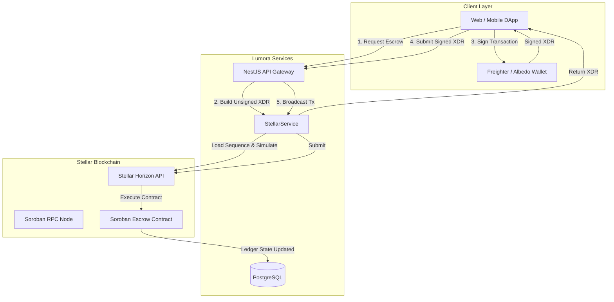
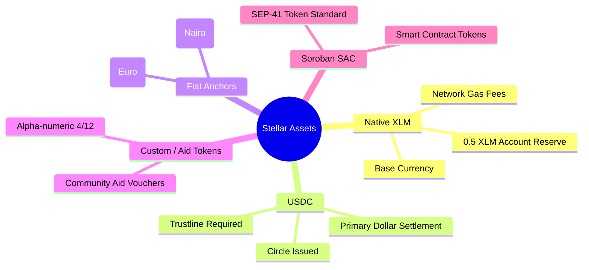
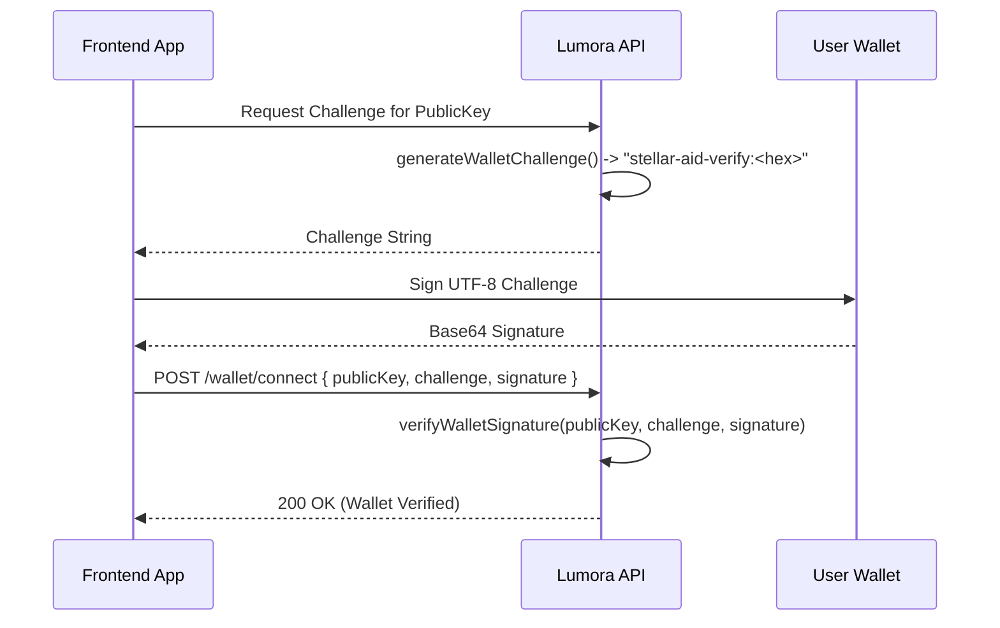

# 🌌 Stellar & Soroban Integration Guide

This guide provides an in-depth technical reference for the **Stellar blockchain** and **Soroban smart contract** integration within Lumora / StellarAid. It details supported asset types, wallet connection standards, on-chain escrow lifecycles, transaction construction, and developer best practices.

---

## 📑 Table of Contents

1. [Architectural Overview](#architectural-overview)
2. [Network Environments & Configuration](#network-environments--configuration)
3. [Supported Asset Types](#supported-asset-types)
   - [Native XLM (Lumens)](#1-native-xlm-lumens)
   - [USDC on Stellar (Circle)](#2-usdc-on-stellar-circle)
   - [Fiat Stablecoins (EURC, NGNT)](#3-fiat-stablecoins-eurc-ngnt)
   - [Custom & Community Aid Tokens](#4-custom--community-aid-tokens)
   - [Soroban Smart Contract Tokens (SAC)](#5-soroban-smart-contract-tokens-sac)
   - [Trustlines & Account Reserves](#6-trustlines--account-reserves)
4. [Wallet Integration](#wallet-integration)
   - [Freighter Wallet Integration](#1-freighter-wallet-integration)
   - [Albedo Web Signer](#2-albedo-web-signer)
   - [Stellar SDK (Programmatic / Backend)](#3-stellar-sdk-programmatic--backend)
   - [Mobile Wallets via WalletConnect](#4-mobile-wallets-via-walletconnect)
   - [Cryptographic Wallet Verification](#5-cryptographic-wallet-verification)
5. [Stellar Payment & Escrow Flows](#stellar-payment--escrow-flows)
   - [Escrow Smart Contract Architecture](#1-escrow-smart-contract-architecture)
   - [Soroban Data Types & ScVal Serialization](#2-soroban-data-types--scval-serialization)
   - [Lifecycle Step 1: Create Escrow (Unsigned XDR)](#step-1-create-escrow-unsigned-xdr)
   - [Lifecycle Step 2: Client Signs & Confirms On-Chain](#step-2-client-signs--confirms-on-chain)
   - [Lifecycle Step 3: Escrow Release & Platform Fee](#step-3-escrow-release--platform-fee)
   - [Lifecycle Step 4: Dispute Resolutions & On-Chain Splits](#step-4-dispute-resolutions--on-chain-splits)
6. [Transaction Lifecycle & Error Handling](#transaction-lifecycle--error-handling)
7. [Testing on Stellar Testnet](#testing-on-stellar-testnet)

---

## 🏗 Architectural Overview

Lumora uses a hybrid Web3 architecture:



* **NestJS API (`src/payments/stellar.service.ts`)**: Constructs unsigned Soroban/Horizon transactions, validates accounts, and submits signed XDR.
* **Soroban Smart Contract (`lumora-contracts`)**: Holds escrow funds trustlessly, executes milestone releases, splits platform fees (2%), and processes dispute settlements.
* **Non-Custodial Client**: Users retain full custody of their private keys. Client wallets (e.g. Freighter) sign all fund movements directly.

---

## 🌐 Network Environments & Configuration

Lumora supports multiple Stellar network modes configurable via `.env`:

| Environment | `STELLAR_NETWORK` | Horizon Endpoint | Soroban RPC Endpoint | Network Passphrase |
| :--- | :--- | :--- | :--- | :--- |
| **Testnet** | `TESTNET` | `https://horizon-testnet.stellar.org` | `https://soroban-testnet.stellar.org` | `Test SDF Network ; September 2015` |
| **Public (Mainnet)** | `PUBLIC` | `https://horizon.stellar.org` | `https://soroban-futurenet.stellar.org` | `Public Global Stellar Network ; September 2015` |

### Environment Variables Configuration

```env
# Stellar Network: TESTNET or PUBLIC
STELLAR_NETWORK=TESTNET

# Platform fee collection & escrow authority wallet
PLATFORM_WALLET_SECRET=SD...PLATFORM_SECRET_KEY...

# Deployed Soroban Escrow Contract Address (C...)
ESCROW_CONTRACT_ID=CBBD...SOROBAN_CONTRACT_ID...
```

---

## 💎 Supported Asset Types

Stellar natively supports multi-currency settlement and token issuance. Lumora supports five asset classes:



### 1. Native XLM (Lumens)

* **Code**: `XLM`
* **Type**: `native`
* **Decimals**: 7 decimal places (1 XLM = 10,000,000 stroops).
* **Usage**: Base currency for transactions and network fees (base fee = 100 stroops = 0.00001 XLM).

### 2. USDC on Stellar (Circle)

USDC is the standard stablecoin used for commissions and services on Lumora.

| Network | Asset Code | Issuer Public Key (`assetIssuer`) |
| :--- | :--- | :--- |
| **Mainnet** | `USDC` | `GA5ZSEJYB37JRC5AVCIA5MOP4RHTM335X2KGX3IHOJAPP5RE34K4KZVN` |
| **Testnet** | `USDC` | `GBBD47IF6LWK7P7MDEVSCWR7DPUWV3NY3DTQEVFL4NAT4AQH3ZLLFLA5` (or issuer test key) |

### 3. Fiat Stablecoins (EURC, NGNT)

* **EURC**: Euro-backed stablecoin issued by Circle (`EURC`).
* **NGNT**: Nigerian Naira anchor on Stellar.
* Enables global creators to receive payment in local or preferred stable value currencies.

### 4. Custom & Community Aid Tokens

Custom alphanumeric assets (4-character or 12-character format) for relief organizations, DAO tokens, or platform rewards:

```typescript
import { Asset } from '@stellar/stellar-sdk';

// Alphanumeric 4
const aidToken = new Asset('AID', 'GAID_ISSUER_PUBLIC_KEY...');

// Alphanumeric 12
const communityToken = new Asset('COMMUNITY123', 'GCOMM_ISSUER_PUBLIC_KEY...');
```

### 5. Soroban Smart Contract Tokens (SAC)

Stellar Asset Contracts (SAC) allow classic Stellar assets (`XLM`, `USDC`) and custom tokens to seamlessly interact with Soroban smart contracts using the SEP-41 standard token interface.

### 6. Trustlines & Account Reserves

To hold any non-native asset on Stellar (such as USDC), an account must establish a **Trustline**:

1. **Base Reserve**: Every account requires a minimum reserve of `1.0 XLM` + `0.5 XLM` per trustline/entry.
2. **Creating a Trustline**:

```typescript
import { Operation, TransactionBuilder, Asset, Networks } from '@stellar/stellar-sdk';

const changeTrustOp = Operation.changeTrust({
  asset: new Asset('USDC', 'GA5ZSEJYB37JRC5AVCIA5MOP4RHTM335X2KGX3IHOJAPP5RE34K4KZVN'),
  limit: '1000000', // Optional max limit
});
```

---

## 👛 Wallet Integration

Lumora supports multiple non-custodial wallet adapters.

### 1. Freighter Wallet Integration

[Freighter](https://www.freighter.app/) is the recommended browser extension wallet for Stellar and Soroban.

#### Installation

```bash
npm install @stellar/freighter-api
```

#### Client-side Connection & Signing

```typescript
import {
  isConnected,
  isAllowed,
  setAllowed,
  getPublicKey,
  signTransaction,
} from '@stellar/freighter-api';

export async function connectFreighter(): Promise<string | null> {
  // 1. Check if Freighter extension is installed
  const connected = await isConnected();
  if (!connected) {
    throw new Error('Freighter wallet extension is not installed');
  }

  // 2. Request user permission
  const allowed = await isAllowed();
  if (!allowed) {
    await setAllowed();
  }

  // 3. Retrieve public key
  const publicKey = await getPublicKey();
  return publicKey; // e.g. "GBBD47IF6LWK7P7MDEVSCWR7DPUWV3NY3DTQEVFL4NAT4AQH3ZLLFLA5"
}

export async function signEscrowXdr(unsignedXdr: string, network: string): Promise<string> {
  const networkPassphrase =
    network === 'PUBLIC'
      ? 'Public Global Stellar Network ; September 2015'
      : 'Test SDF Network ; September 2015';

  const signedXdr = await signTransaction(unsignedXdr, {
    networkPassphrase,
  });

  return signedXdr;
}
```

---

### 2. Albedo Web Signer

[Albedo](https://albedo.link/) allows signing without requiring browser extensions.

```typescript
import albedo from '@albedo-link/intent';

// 1. Request public key
export async function connectAlbedo(): Promise<string> {
  const result = await albedo.publicKey({});
  return result.pubkey;
}

// 2. Sign transaction XDR
export async function signWithAlbedo(xdr: string, network: string): Promise<string> {
  const result = await albedo.tx({
    xdr,
    network: network === 'PUBLIC' ? 'public' : 'testnet',
  });
  return result.signed_envelope_xdr;
}
```

---

### 3. Stellar SDK (Programmatic / Backend)

For automated workers, bots, and backend signing:

```typescript
import { Keypair, TransactionBuilder, Networks } from '@stellar/stellar-sdk';

const keypair = Keypair.fromSecret(process.env.PLATFORM_WALLET_SECRET!);

// Sign transaction envelope
const transaction = TransactionBuilder.fromXDR(unsignedXdr, Networks.TESTNET);
transaction.sign(keypair);
const signedXdr = transaction.toXDR();
```

---

### 4. Mobile Wallets via WalletConnect

Supports mobile wallets such as LOBSTR and Vibrant via the Stellar WalletConnect adapter standard.

---

### 5. Cryptographic Wallet Verification

Lumora verifies account ownership using the sign-a-challenge flow (`src/common/wallet/wallet-signature.util.ts`):



---

## ⚡ Stellar Payment & Escrow Flows

### 1. Escrow Smart Contract Architecture

The Soroban Escrow contract (`src/payments/stellar.service.ts`) enforces the following smart contract methods:

| Method | Caller | Description | Parameters |
| :--- | :--- | :--- | :--- |
| `create_escrow` | Client | Locks payment amount into smart escrow | `client`, `artist`, `amount` (i128), `asset_code`, `commission_id` |
| `release_payment` | Platform / Auth | Releases net payment to artist & fee to platform | `artist`, `platform`, `gross_amount`, `fee_amount`, `asset_code`, `commission_id` |
| `refund_payment` | Platform / Admin | Returns 100% of escrowed funds to client | `client`, `gross_amount`, `asset_code`, `commission_id` |
| `partial_release_payment` | Platform / Admin | Splits escrow funds by basis points (`artistShareBps`) | `artist`, `client`, `platform`, `gross`, `artist_bps`, `fee`, `asset_code`, `commission_id` |

---

### 2. Soroban Data Types & ScVal Serialization

Soroban functions receive arguments formatted as `xdr.ScVal` objects:

#### Address Serialization

```typescript
private addressToScVal(address: string): StellarSdk.xdr.ScVal {
  const rawKey = StellarSdk.StrKey.decodeEd25519PublicKey(address);
  return StellarSdk.xdr.ScVal.scvAddress(
    StellarSdk.xdr.ScAddress.scAddressTypeAccount(
      StellarSdk.xdr.PublicKey.publicKeyTypeEd25519(rawKey),
    ),
  );
}
```

#### i128 Integer (Amount in Stroops) Serialization

```typescript
private i128ToScVal(value: bigint): StellarSdk.xdr.ScVal {
  const hi = new StellarSdk.xdr.Hyper(BigInt.asIntN(64, value >> BigInt(64)));
  const lo = new StellarSdk.xdr.UnsignedHyper(BigInt.asUintN(64, value));
  return StellarSdk.xdr.ScVal.scvI128(
    new StellarSdk.xdr.Int128Parts({ hi, lo }),
  );
}
```

---

### Step 1: Create Escrow (Unsigned XDR)

When the client initiates escrow (`POST /v1/payments/commissions/:id/escrow`), `StellarService` creates the Soroban contract call transaction:

```typescript
const contract = new StellarSdk.Contract(this.escrowContractId);
const sourceAccount = await this.loadAccount(clientPublicKey);

const transaction = new StellarSdk.TransactionBuilder(sourceAccount, {
  fee: StellarSdk.BASE_FEE,
  networkPassphrase: this.networkPassphrase,
})
  .addOperation(
    contract.call(
      'create_escrow',
      clientAddr,
      artistAddr,
      amountScVal,
      assetScVal,
      commissionScVal,
    ),
  )
  .setTimeout(300)
  .build();

const unsignedXdr = transaction.toXDR();
```

---

### Step 2: Client Signs & Confirms On-Chain

1. The client signs `unsignedXdr` using Freighter.
2. The client posts `signedXdr` to `POST /v1/payments/confirm`.
3. `StellarService.submitTransaction()` transmits the envelope to Stellar Horizon / Soroban RPC:

```typescript
async submitTransaction(signedXdr: string) {
  const transaction = StellarSdk.TransactionBuilder.fromXDR(
    signedXdr,
    this.networkPassphrase,
  );
  const result = await this.server.submitTransaction(transaction);
  return { txHash: result.hash, successful: result.successful ?? true };
}
```

---

### Step 3: Escrow Release & Platform Fee

When a commission is marked `COMPLETED`, the platform executes `releaseFundsOnChain()`:

* **Gross Amount**: $200.00$ XLM
* **Platform Fee (2%)**: $4.00$ XLM (sent to platform wallet)
* **Net Artist Payout**: $196.00$ XLM (sent directly to artist wallet)

```typescript
const { txHash } = await this.stellar.releaseFundsOnChain(
  artistWallet,
  grossAmount,
  platformFee,
  assetCode,
  commissionId,
);
```

---

### Step 4: Dispute Resolutions & On-Chain Splits

In the event of project disputes:

* **`REFUND`**: Invokes `refund_payment` to return 100% of the funds to the client.
* **`RELEASE`**: Invokes `release_payment` to pay the artist in full.
* **`PARTIAL`**: Invokes `partial_release_payment` splitting funds based on basis points (e.g. `6000 bps` = 60% artist, 40% client refund, minus 2% platform fee).

---

## 🛡 Transaction Lifecycle & Error Handling

Common Stellar transaction errors and resolution strategies:

| Stellar Error Code | Description | Resolution Strategy |
| :--- | :--- | :--- |
| `tx_bad_seq` | Sequence number mismatch | Reload account sequence from Horizon and rebuild transaction. |
| `op_underfunded` | Insufficient balance for amount + reserve | Ensure client has sufficient balance above the 1.0 XLM minimum reserve. |
| `op_no_trust` | Destination does not have trustline | The destination wallet must add a trustline for the asset (e.g. USDC). |
| `tx_too_late` | Transaction expired past timeout | Increase timeout (default 300s) and prompt user to sign promptly. |
| `tx_failed` | Generic execution failure | Inspect `extras.result_codes` in Horizon response for detailed operation error. |

---

## 🧪 Testing on Stellar Testnet

### 1. Funding Testnet Accounts via Friendbot

Testnet accounts must be funded before they can sign or hold assets:

```bash
curl -X GET "https://friendbot.stellar.org?addr=GBBD47IF6LWK7P7MDEVSCWR7DPUWV3NY3DTQEVFL4NAT4AQH3ZLLFLA5"
```

### 2. Inspecting Transactions on Stellar Expert

You can trace all testnet and mainnet transactions, contract invocations, and account balances on **Stellar.Expert**:

* Testnet Explorer: `https://stellar.expert/explorer/testnet`
* Mainnet Explorer: `https://stellar.expert/explorer/public`
